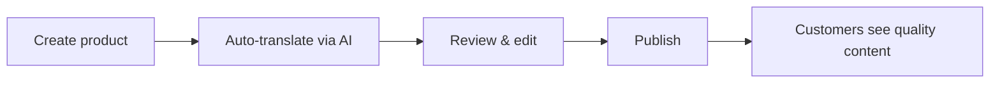

# Polygloss

**E-commerce that speaks every language**

Self-hosted multilingual store engine. Native multi-language support built into the core, not bolted on as a plugin.

Website: [polygloss.dev](https://polygloss.dev/)

## Live Demo

- **Store:** https://demo.polygloss.dev
- **Admin Panel:** https://admin.polygloss.dev
  - Demo access: `demo@polygloss.dev` / `demo123` (read-only)

## Problem

Machine translation (Google Translate, browser plugins) doesn't work well for e-commerce. Product names get mangled, descriptions lose meaning, customers lose trust. Sales follow.

## Solution

Every piece of content is human-approved before going live. AI can generate drafts to speed up your workflow, but you review and edit before anything reaches customers.

## How it works

1. **Create product** in your primary language
2. **Auto-translate** to all other languages with one click (via DeepL API)
3. **Review and edit** - fix nuances, adjust tone, correct terminology
4. **Save** - only human-approved content goes live

This is not machine translation for customers. This is a productivity tool for content managers.

## Features

- 🌍 **Unlimited languages** - add as many as needed
- 🤖 **AI-assisted translations** - generate drafts via DeepL API, then review and edit
- 🎨 **Full UI localization** - translate buttons, labels, checkout flow, everything
- 🔄 **Fallback system** - missing translation? Show default language
- 🏠 **Self-hosted** - your server, your data, your rules
- 🔑 **Your own API keys** - full control over AI usage and costs
- 💳 **No payment lock-in** - integrate your own payment provider

## Tech Stack

**Backend**
- Java 21, Spring Boot 3.2
- PostgreSQL 14+
- Spring Security, JWT authentication
- Flyway migrations

**Frontend**
- Angular 19
- Tailwind CSS (storefront)
- Angular Material (admin panel)

## API Overview

| Resource | Description |
|----------|-------------|
| `/api/languages` | Language management |
| `/api/categories` | Product categories with translations |
| `/api/products` | Products with translations and images |
| `/api/orders` | Order management |
| `/api/ui` | UI element translations |
| `/api/ui-texts` | Long-form content translations |
| `/api/users` | User management (admin) |
| `/api/checkout` | Public checkout flow with email verification |

Full API documentation available via Swagger UI.

## AI Translation Setup

AI-assisted translation requires a DeepL API key. Each deployment uses its own API key - no shared tokens, full control over usage and costs.
Without API key, manual translation entry works as usual.

## Payment Integration

Polygloss is intentionally shipped without a payment module. Every business has different requirements - payment providers, merchant accounts, regional regulations.

The checkout flow collects customer data and creates orders. Payment integration is left for the implementer to add based on their specific needs.

## License

Proprietary © 2025 [Kalba Lab](https://kalba.dev). Commercial use requires a license agreement.
